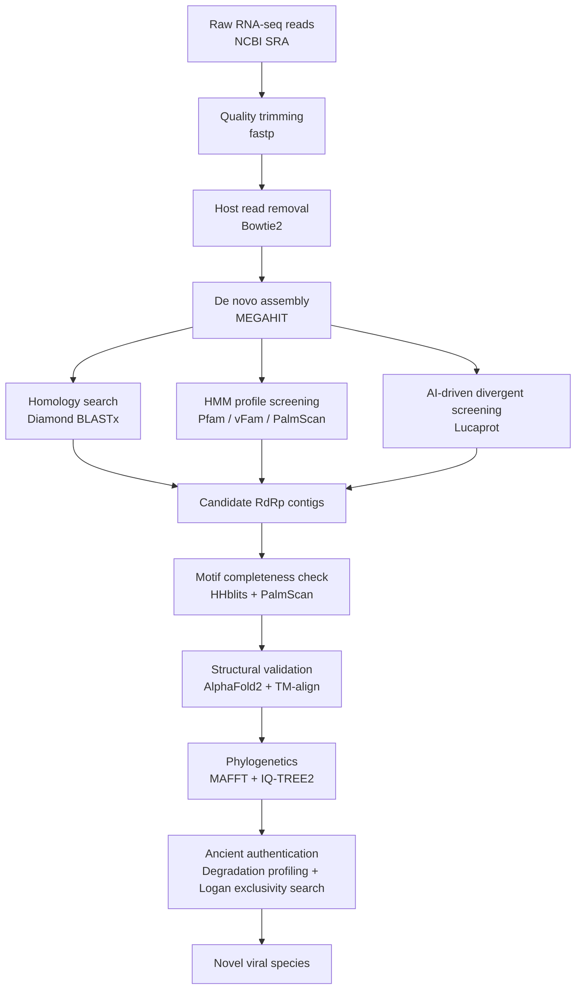

# 🧬 AI-Powered Discovery of Novel RNA Viruses from Pleistocene Permafrost

**Paleotranscriptomic mining of ancient and extinct host genomes reveals two previously unknown RNA viruses in a 14,300-year-old Pleistocene wolf**

[](#)
[](LICENSE)
[](https://www.python.org/)
[](#)

> **TL;DR:** Using an AI-driven protein language model (Lucaprot) combined with AlphaFold2 structural validation, we mined publicly available RNA-seq datasets from extinct megafauna and discovered two novel, deeply divergent RNA viruses inside a **14,300-year-old Pleistocene gray wolf** carcass — pushing the known preservation window for intact RNA viruses from centuries to over fourteen millennia.

---

## 📌 Overview

Ancient RNA viruses are notoriously difficult to detect: RNA is chemically unstable, and divergent ancient sequences routinely escape standard homology search tools. This project develops and applies a **multi-tiered, AI-assisted computational pipeline** to screen billions of raw sequencing reads from three extinct/ancient host species — the **woolly mammoth**, **Tasmanian tiger**, and **Pleistocene gray wolf** — for conserved viral RNA-dependent RNA polymerase (RdRp) signatures.

The pipeline combines:
- **Homology-based search** (Diamond BLASTx against curated viral RefSeq/RdRp databases)
- **Profile HMM screening** (Pfam, vFam, PalmScan) for divergent signal
- **AI-driven protein language modeling** ([Lucaprot](https://github.com/) — deep learning–based RdRp detection) to catch highly divergent, homology-resistant sequences
- **Structural validation** via **AlphaFold2** + TM-align, to confirm catalytic motif (A/B/C) conservation independent of primary sequence divergence
- **Rigorous ancient-DNA/RNA-style authentication**, including degradation profiling against an internal phiX174 spike-in control and exhaustive exclusivity screening across the ~5 million-sample **Logan planetary-scale SRA database**

### 🔑 Key Findings

| | |
|---|---|
| 🐺 **Host** | 14,300-year-old *Canis lupus* (Pleistocene gray wolf), Tumat site, Sakha Republic, Russia |
| 🦠 **Discoveries** | 2 novel, near-complete RNA viruses — *Duamitovirus tumati* & *Orthocurvulavirus tumati* |
| 🧩 **Divergence** | 57.6% and 60.8% RdRp amino acid identity to closest known relatives (well below ICTV species thresholds) |
| 🧠 **AI methods** | Lucaprot (protein language model) + AlphaFold2 structural validation |
| 🕰️ **Significance** | Extends documented RNA virus preservation from centuries to **>14,000 years** — the oldest host-associated RNA viruses recovered to date |
| ✅ **Authentication** | RNA degradation profiling, phiX174 internal control, and database-exclusivity screening (Logan, ~5M transcriptomes) confirm genuine ancient origin |

---

## 🧠 Why This Matters

This work demonstrates that:
1. **AI-based sequence and structure prediction tools have matured** to the point where computational detection is no longer the bottleneck in paleovirology — physical RNA recovery is.
2. **Permafrost-preserved carcasses are viable substrates** for reconstructing not just host genomes, but entire **ancient microbial/viral ecosystems** (in this case, a fungal microbiome associated with the wolf carcass).
3. A generalizable pipeline now exists for mining **public SRA data from any ancient or extinct species** for undiscovered viral diversity.

---

## 🧪 Pipeline



---

## 📂 Repository Structure

```
.
├── data/                  # Accession lists & metadata for SRA libraries used
├── scripts/               # Analysis pipeline (QC, assembly, homology search, HMM, Lucaprot wrapper)
├── phylogenetics/         # Alignment, trimming, and tree-building scripts (MAFFT / IQ-TREE2)
├── structure/             # AlphaFold2 inference & structural alignment (TM-align) scripts
├── authentication/        # Degradation profiling & Logan database exclusivity search
├── results/               # Final viral contigs, phylogenies, and figures
└── README.md
```

*(Adjust the tree above to match your actual folder layout.)*

---

## ⚙️ Methods Summary

1. **Data acquisition & QC** — Public RNA-seq libraries from *Mammuthus primigenius*, *Thylacinus cynocephalus*, and *Canis lupus* retrieved from NCBI SRA; adapter/quality trimming with `fastp`.
2. **Host removal & assembly** — Reads mapped to closest reference genomes (Bowtie2); unmapped reads assembled de novo with `MEGAHIT`.
3. **Viral candidate detection** — Diamond BLASTx, Pfam/vFam HMMER profiles, and the **Lucaprot** deep-learning model applied in parallel to maximize sensitivity to divergent sequences.
4. **Motif & structural validation** — Candidate RdRps assessed for catalytic A/B/C motif completeness (HHblits, PalmScan) and 3D structure predicted with **AlphaFold2**; TM-align used for structural comparison to known RdRps.
5. **Phylogenetics** — MAFFT (L-INS-i) alignment, trimAl trimming, IQ-TREE2 maximum-likelihood trees with ModelFinder + 1000 UFBoot replicates.
6. **Ancient authentication** — Comparative RNA degradation profiling against a co-assembled phiX174 spike-in control, plus exhaustive database-exclusivity search across the Logan planetary-scale SRA index (~5M transcriptomes/metatranscriptomes).

Full methodological detail is provided in the manuscript (see [Preprint](#-citation) below).

---

## 📊 Results Snapshot

- **Contig 1 (*Duamitovirus tumati*, 1,890 nt)** — Near-complete monopartite mitovirus genome; 630-aa RdRp; 57.6% aa identity to its closest relative (*Rhizoctonia solani* mitovirus).
- **Contig 2 (*Orthocurvulavirus tumati*, 1,566 nt + 822 nt segment)** — Bipartite genome; 496-aa RdRp (60.8% aa identity to *Rhizoctonia solani* dsRNA virus 1) plus a hypothetical protein–encoding second segment.
- Both viruses fall **within established fungal virus genera** but represent **novel species** by ICTV criteria, and both show **structurally intact catalytic RdRp motifs** despite deep sequence divergence — strong evidence of retained biological function.
- **No mammalian RNA viruses** were detected in any ancient library, consistent with either absence of active infection at death or preferential degradation/loss of host viral transcripts.

---

## 📖 Citation

If you use this pipeline, data, or findings, please cite:

> Zaheer ud Din, S. & Wu, Q. (2026). *AI-Powered Discovery of Novel RNA Viruses from the Permafrost of a 14,300-Year-Old Pleistocene Wolf.* bioRxiv preprint. [Link to be added upon posting]

```bibtex
@article{zaheeruddin2026permafrostrnaviruses,
  title   = {AI-Powered Discovery of Novel RNA Viruses from the Permafrost of a 14,300-Year-Old Pleistocene Wolf},
  author  = {Zaheer ud Din, Syed and Wu, Qingfa},
  journal = {bioRxiv},
  year    = {2026}
}
```

---

## 🧾 Data Availability

- Raw RNA-seq data: **NCBI SRA** (accession list in [`data/`](./data))
- Novel viral consensus sequences: **NCBI GenBank**, submission ID `SUB16436308`
- Analysis code: this repository

---

## 👤 Author

**Syed Zaheer ud Din**
Division of Life Sciences and Medicine, University of Science and Technology of China (USTC)
📧 [Add your email or lab page link]
🔗 [LinkedIn](#) · [Google Scholar](#) · [ORCID](#)

**Corresponding author:** Qingfa Wu ([wuqf@ustc.edu.cn](mailto:wuqf@ustc.edu.cn)), Key Laboratory of Anhui Province for Emerging and Reemerging Infectious Diseases, USTC

---

## 🙏 Acknowledgements

This work was supported by the Strategic Priority Research Program of the Chinese Academy of Sciences (Grant No. XDB0490000), the Chinese Academy of Sciences (CAS), and CAS-ANSO. Computational resources provided by the USTC Supercomputing Center.

---

## 📄 License

This repository is released under the [MIT License](LICENSE) unless otherwise noted. Please cite the associated preprint when reusing code or data.
